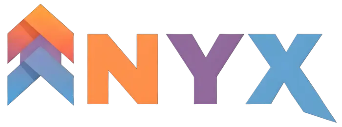

<!-- ===================================== -->
<!--            PROJECT NYX                -->
<!-- ===================================== -->

<p align="center">
  
</p>

<p align="center">
  <i>Build your presence in the void</i>
</p>

<p align="center">
  
  
  
</p>

---

## ✨ About

**NYX** is a modern, app-like web experience designed with precision, minimalism, and performance in mind.  
Built to feel native on **desktop and mobile**, without unnecessary scrolls, oversized fonts, or clutter.

> This project focuses on **visual consistency**, **clean UX**, and **scalable architecture**.

---

## ⚙️ Tech Stack

```txt
Frontend   → React + TypeScript
Bundler    → Vite
Styling    → Tailwind CSS
Assets     → SVG / WebP
Design     → App-first, Mobile-perfect
